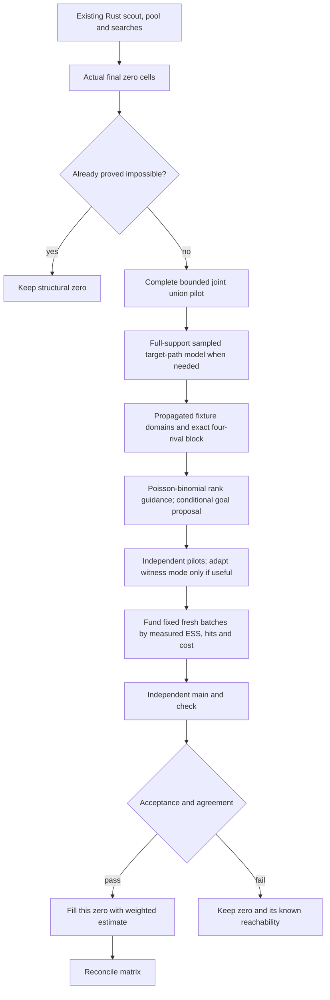

# Native Rust rare-position coverage with 50% additional time

October 1, 2026. Experiments and code are local; **not committed or pushed**.
`FUTURE_EXPERIMENTS.md` is the chronological progress ledger. This report records
the selected final configuration separately from development variants.

## Result

The selected profile adds **207 nonzero cell-runs**, covering
**39 distinct snapshot/team/position cells**, in
63 paired full requests. It removes **62.9%** of the
reachable/undecided zero cell-runs (329 → 122).
Repeated seeds are counted as cell-runs, not additional positions in one table.

No baseline nonzero cell, certified impossibility, or known reachability was
lost. Game importance is identical in every pair. The largest measured paired
full-request latency increase is **46.7%**.
Every estimator uses four workers. The allocation is a measured work controller,
not a hard real-time guarantee for every possible future input. Warm individual
paired increases peak at **35.0%**, with **0** pairs above 50%.

```sh
RUST_ODDS_RARE_TAIL=coverage odds-rust/target/release/golaberto-odds serve 127.0.0.1:6577
```

This is opt-in; unset retains the earlier pipeline. It targets rough probability
orders, with fresh main/check batches and explicit precision metadata. Set
`RUST_ODDS_RARE_TAIL_QUALITY=current` for stricter final acceptance at lower coverage.

## Cohort and paired coverage

Seven request snapshots: six reference groups, plus historical 16653. Development
seeds 801,804,808,817,818,911; reserved seeds 1201,1213,1229. Selection preceded
held-out evaluation. The final shared-guide/funding safety variant was
validated on all nine seeds without tuning individual held-out cells. Funding
was reduced in response to timing failures; these repeated held-out checks
are safety validation, not a second untouched model-selection holdout.

| Snapshot | Eligible zeros before, per request | After | Impossible zeros, per request | New cell-runs | Distinct gained cells | Gains/request |
|---|---:|---:|---:|---:|---:|---:|
| group-15902-31d66705 | 0–0 | 0–0 | 0 | 0 | 0 | 0–0 |
| group-16413-a2eef0a8 | 0–0 | 0–0 | 0 | 0 | 0 | 0–0 |
| group-16498-44eabb47 | 14–20 | 6–15 | 17 | 59 | 15 | 4–9 |
| group-16653-71d4fea8 | 8–13 | 2–4 | 48 | 71 | 11 | 5–11 |
| group-16982-9327edcd | 0–0 | 0–0 | 0 | 0 | 0 | 0–0 |
| group-16983-43969b02 | 0–0 | 0–0 | 0 | 0 | 0 | 0–0 |
| group-16653-2d1c1d6f | 6–12 | 0–2 | 43 | 77 | 13 | 6–11 |

Development adds 147 cell-runs; held-out adds
60. No new impossibility proofs are claimed by this
probability campaign. Existing proofs are retained. Historical 16653 resolves
all eligible zeros in some requests; that does not establish universal coverage.
The four control snapshots already have full nonzero matrices. Total paired
request time rises **16.3%**; this gains
**46.6** nonzero cell-runs per additional full-request second. This
is a cohort work metric, not extra distinct cells per second in one request.

## Baseline and fairness

The baseline is the CURRENT native Rust code with the preceding propagated-joint
work enabled, not Go and not an assumed one-second allowance. Frozen binary
SHA256: `0f5c36dd722bf4f530036826967c3c7ff6671e0cf2587a417213466c32389a92`. Final candidate SHA256:
`3a86581dc70e089bf896f475e7025227266eec65991a11b21bab07b710f2a8a1`. Rust 1.93.1, locked dependencies, release build.

Baseline source is reconstructible from `2026-10-01-rare50/baseline.patch` and
`baseline-propagated.rs`, applied to commit 65b71493e738ce434f071e717b0646a0e4c8a842.
Embedded build paths can change rebuilt binary hashes. Final source hashes are
in `2026-10-01-rare50/final-source-sha256.json`. The measured binary is frozen
at `/private/tmp/golaberto-rare50-final35-validated`. Input hashes, flags,
per-seed times and comparisons are in `final-results.json`; no golden
probabilities are read by the production binary. No DB writes were performed.

All baseline/candidate full requests run sequentially, alternating order.
No compilation or other benchmark runs concurrently. Warm servers execute ten
alternating requests each; first two are excluded from latency medians. CPU
and peak RSS cover the whole ten-request process, including warmup/startup.

## Warm latency, CPU and memory

| Snapshot | Baseline ms | Candidate ms | Wall increase | Process CPU increase | Peak RSS MiB |
|---|---:|---:|---:|---:|---:|
| group-16498-44eabb47 | 623.1 | 828.0 | +32.9% | +45.1% | 200.6 → 395.0 |
| group-16653-71d4fea8 | 661.8 | 771.6 | +16.6% | +21.5% | 203.1 → 271.0 |
| group-16982-9327edcd | 294.9 | 300.4 | +1.9% | +2.9% | 26.1 → 26.1 |
| group-16653-2d1c1d6f | 635.7 | 751.5 | +18.2% | +27.4% | 196.7 → 265.5 |

CPU time is summed across workers; wall time is elapsed request time. The same
four-worker maximum does not imply the same average CPU utilization. The 50% allowance here is evaluated as request wall time with four workers.
Summed CPU increases can exceed 50%; no 50% CPU-cost cap is claimed. Earlier
unshared warm 16498 used 55% more CPU and 448MiB. The first 45% funding profile
recovered 223 cell-runs but had a 52.8% warm-pair wall increase and 64.5% more CPU;
it is retained in the ledger and is not the selected funding setting.

### Where the time goes: warm 16498 median stages

| Stage | Baseline ms | Candidate ms |
|---|---:|---:|
| scout | 46.10 | 45.82 |
| pool.mc | 59.67 | 59.46 |
| search.initial_conditioning | 47.39 | 47.83 |
| search.guided | 20.27 | 20.10 |
| search.extra | 117.84 | 118.67 |
| search.witnesses | 10.90 | 10.95 |
| search.point_tilt | 294.29 | 293.48 |
| search.peers | 0.01 | 0.01 |
| search.domains | 3.65 | 3.69 |
| search.rare_tail | 0.00 | 203.59 |

Parent `pool`/`search` times include child stages; do not add both. Training
logs report combined model construction and pilot sampling, including discarded
proposals. Final logs report fresh main/check sampling separately. Thus a
reported `training_ms` is not pure model setup. Construction is substantial
for difficult shared-fixture roots; larger case unions displaced useful finals.

### Portfolio preparation and funding costs

Medians across the nine final cold pairs for each difficult snapshot:

| Snapshot | Preparation wall ms | Entire portfolio wall ms | Funded cells | Accepted cells | Shared guide hits |
|---|---:|---:|---:|---:|---:|
| group-16498-44eabb47 | 154.1 | 220.0 | 9 | 6 | 18 |
| group-16653-71d4fea8 | 57.4 | 123.1 | 9 | 8 | 5 |
| group-16653-2d1c1d6f | 58.9 | 123.3 | 9 | 8 | 2 |

Preparation is model construction **plus** all pilots, adaptation and funding.
It is measured from the portfolio start through final-batch planning, not a sum
of overlapping worker durations. The difference of the two medians is not an
exact sampling-stage measurement. The dominant opportunity is preparation for
16498; extra case construction performed worse because it consumed final-batch
funding. Original point-tilt remains the largest earlier stage, but attempted
reallocation failed either coverage or latency checks.

## Selected algorithm



1. Keep the existing 20k scout, 100k pool, proof allocation, point-tilt and other
   estimators. Attempts to remove point-tilt lost existing cells or exceeded the
   allowance after triggering other rescue work.
2. Work on actual final zero cells, excluding certified impossible cells. No
   team IDs or particular finishing ranks select search eligibility.
3. Try a complete propagated union (up to 256 target patterns/128 feasible cases)
   and, when needed, sample target paths instead of truncating event support.
   The sampled model caches up to 32 roots with 60k construction nodes and 4M
   logical guide values per model. Failed construction is charged; exhausted
   paths use the defensive proposal, never an impossibility label.
4. Target outcome proposal: 10% exact necessary target-event distribution and 90%
   cached root proposal. Remaining fixtures use exact masked probabilities,
   selected-rival shared conditioning, and guided likelihood ratios. Fixed
   fixture probabilities and joint normalizers are included.
5. Rank guidance uses a Poisson-binomial approximation for the remaining number
   above/below the target; this is a proposal, not a probability estimate or
   reachability proof. Small tails are computed directly instead of subtracting
   a CDF rounded to one. Conditional goal tilts use exact table normalizers and
   actual production sorting. Points/wins ties retain actual later rules.
6. A pilot with low ESS can add a witness-directed mode; retain it only if a
   separate pilot improves ESS. Its 50/50 mixture includes the broader guided
   mode, and both path densities are evaluated. Ordinary MC defense alone
   proved practically inadequate in an early rejected experiment.
7. Omit a guided-loop fixture only if both endpoints remain strictly on known
   sides of the target and their point/win bounds are slack throughout their
   entire ranges. Actual omitted outcomes are still sampled from their masked
   true distribution for the complete season. Tied teams are retained.
8. Share frozen suffix guides only with identical ordered fixtures, endpoints,
   packed gains, probabilities and team count. Bases/bounds stay per cell.
   Weak cache references do not retain completed models across requests.
9. Additional allowance is 35% of elapsed **native calculation** time, excluding
   upload/HTTP queue wait. Stop starting training after 65% of this allowance;
   fund final batches using pilot cost estimates and four worker bins. Sampling
   batches are fixed before main/check draws. No first-hit stopping.
10. Fill only zeros. Main/check results do not replace earlier positive estimates.
    Matrix reconciliation can make tiny numerical adjustments to existing odds.

### Acceptance versus precision

Existing estimators retain their existing gates. For these final rough estimates,
main requires ≥30 hits, ESS ≥4, relative SE ≤60%, max weight share ≤35%, split-batch gap ≤1.5.
The independent check requires ≥30 hits, ESS ≥3, relative SE ≤75%, and main/check within
a factor of 5. Predicted main allocation targets 10 effective samples, 1000–6000 draws;
check is at least 1000. `meets_precision_goal` retains the existing stricter
criterion and may be false for a published rough estimate.

These checks are finite-sample diagnostics, not a guaranteed confidence interval
or guaranteed order of magnitude. A full-support proposal can still miss a major
mode. The rejected restricted model demonstrated this directly. Scores use the
same finite numerical Poisson-table support as the existing estimator; this
experiment does not claim unrestricted goal-tail impossibility.

## Independent quality checks

98 independently scorable new cell-runs: candidate/reference ratios **0.463–1.48**. Only established `reference_is`/`reference_mc` cells are scored.
Provisional IS and previously reachable-without-reference cells are listed but
not treated as golden truth. Historical 16653 is a different snapshot and is not
scored against current 16653 probabilities. All probabilities in JSON/report are
fractions; multiply by 100 for percentages.

The exact tests enumerate shared fixture assignments in small leagues, compare
weighted rank probabilities, check complete/incomplete proposal mixtures,
verify irrelevant-fixture compaction, and compare conditional goal-tail IS to
an independently summed distribution. Bounds/witnesses are never inserted as
point probability estimates.

## Development experiments and recommendations

Most arms use three difficult snapshots × three seeds; arms with 3 pairs are a
single-seed screen. Funding screens are separate profiles on the same mechanisms. Compare aggregate gains on equal cohorts, not raw totals
from different numbers of requests. The ledger contains chronological details.

| Arm | Pairs | Gained cell-runs | Old positives lost | Worst wall increase | Recommendation |
|---|---:|---:|---:|---:|---|
| union | 9 | 19 | 0 | +20.6% | Useful first control; superseded |
| portfolio | 9 | 63 | 0 | +82.5% | Reject: latency |
| funded | 9 | 66 | 0 | +38.1% | Adopt allocation principle |
| subset | 3 | 24 | 0 | +38.4% | Reject: missed probability modes |
| goals | 3 | 24 | 0 | +42.4% | Adopt goal proposal |
| multimode | 9 | 70 | 0 | +46.1% | Adopt defense; adapt setup |
| adaptive | 9 | 79 | 0 | +47.4% | Adopt pilot-selected modes |
| order-rare | 9 | 73 | 0 | +47.4% | Do not adopt globally |
| order-uncertain | 9 | 76 | 0 | +44.5% | Do not adopt globally |
| dynamic-valid | 3 | 8 | 0 | +105.8% | Reject: >100% latency increase |
| fallback | 9 | 77 | 0 | +56.7% | Defer: over allowance |
| cases | 3 | 23 | 0 | +48.2% | Defer: setup displaces finals |
| replace-tilt | 9 | 69 | 3 | +20.6% | Reject: lost old positives |
| four-rivals | 9 | 77 | 0 | +44.2% | Adopt cheaper exact block |
| funded-tilt | 9 | 85 | 0 | +72.2% | Reject: latency |
| witness-fixtures | 9 | 74 | 0 | +57.9% | Defer: weaker coverage/latency |
| omit | 9 | 78 | 0 | +42.7% | Adopt strict irrelevance rule |
| order-quality | 9 | 82 | 0 | +47.7% | Adopt for rough coverage |
| order-cases | 9 | 74 | 0 | +44.9% | Reject global enumeration |
| reallocate-safe | 9 | 85 | 0 | +62.5% | Reject: original policy at lower tail budget |
| hard-cases | 9 | 79 | 0 | +44.7% | Defer: no aggregate improvement |
| pilot-reuse | 9 | 82 | 0 | +48.1% | Defer: no aggregate improvement |
| high-ess-tilt | 9 | 82 | 0 | +56.2% | Reject: no gain, over allowance |
| shared-guides | 9 | 81 | 0 | +44.6% | Adopt memory sharing |
| headroom40 | 9 | 80 | 0 | +55.1% | Reject funding: cold wall increase >50% |
| headroom35 | 9 | 76 | 0 | +44.5% | Select funding headroom |

The `dynamic` run without `-valid` is INVALID (old binary after a failed build)
and excluded. The `reallocate-safe` label was an intended edit that did not
reach that binary: it repeated the original R17 allocation at a lower tail
allowance. It is not evidence for the corrected high-ESS-only policy; the
separate `high-ess-tilt` run is that actual test. Corrections are recorded in the
ledger, not silently reinterpreted.

## Research from other rare-event problems

- Reliability/queue overflow: [Glasserman et al., multilevel splitting (1999)](https://business.columbia.edu/sites/default/files-efs/pubfiles/4273/multilevel_splitting.pdf)
  motivates intermediate levels and work-normalized evaluation. A witness alone
  does not determine the event's mass. Football application is an inference.
- Discrete/SAT rare events: [Walter (2015)](https://arxiv.org/abs/1507.00919)
  motivates explicit treatment of discontinuous scores. A continuous-score
  adaptive splitting algorithm cannot simply be reused for discrete points/ranks.
- Multiple failure modes: [Botev, Chan and Kroese (2011)](https://people.smp.uq.edu.au/DirkKroese/ps/WSC_BCK.pdf)
  motivates mixture proposals. The native defensive guided mixtures were tested
  rather than assuming one successful witness identifies the dominant mode.
- Queueing, random walks, insurance and graph counting:
  [Blanchet and Lam (2012)](https://www.columbia.edu/~khl2114/files/1-s2.0-S1876735411000250-main.pdf)
  motivates state-dependent guidance and evaluation of variance, not only hits.
  No asymptotic efficiency theorem is claimed for this football sampler.

Fixed-level splitting/SMC remains a research direction. A production experiment
would need valid discrete weighting, suitable shared-fixture transition kernels,
and independent root replications for uncertainty. It was not fabricated or
claimed to outperform the tested native portfolio.

## Remaining eligible zeros

These are **team/position IDs**, not impossible cells. Seed 808 illustrates the
remaining work; other seeds can publish a different subset.

- **group-16498-44eabb47, seed 808:** 16/11, 16/12, 16/13, 16/14, 16/15, 16/16, 17/11, 17/12, 17/13, 5/18, 5/19.
- **group-16653-71d4fea8, seed 808:** 125/11, 95/3, 95/4.
- **group-16653-2d1c1d6f, seed 808:** 95/1, 95/3.

All final eligible zeros have known reachability in this cohort; none remain
undecided. Structural impossibility is a separate category.

Failures combine low event hit rates, dominant importance weights, insufficient
independent confirmation, and final batches too costly to fund. Larger model
setup does not automatically help: it consumes the time needed to sample its
proposal. Best/worst reachable ranks do not establish intermediate reachability.
We report the strongest measured configuration within the allowance, not a proof
that no other algorithm can eliminate more zeros.

## Reproduce

```sh
cargo build --release --offline --locked --manifest-path odds-rust/Cargo.toml --bin golaberto-odds -j4
python3 experiments/rare_positions/benchmark_propagated_joint.py \
  --baseline /private/tmp/golaberto-rare50-baseline \
  --candidate odds-rust/target/release/golaberto-odds --production-candidate \
  --flag RUST_ODDS_RARE_TAIL=coverage \
  --seeds 801,804,808,817,818,911,1201,1213,1229 --output /private/tmp/rare50-final35
python3 experiments/rare_positions/benchmark_propagated_joint.py \
  --baseline /private/tmp/golaberto-rare50-baseline \
  --candidate odds-rust/target/release/golaberto-odds --production-candidate \
  --flag RUST_ODDS_RARE_TAIL=coverage --cases 16498,16653,16982 \
  --persistent --output /private/tmp/rare50-final35-warm
python3 experiments/rare_positions/write_rare50_report.py \
  --pairs /private/tmp/rare50-final35 --warm /private/tmp/rare50-final35-warm
cargo test --release --offline --locked --manifest-path odds-rust/Cargo.toml -j4 -- --test-threads=1
```

Full suite: **77 passed, 2 DB tests ignored**. No MySQL mutation,
Rails/UI changes, commits or pushes. Code, report, portable results and the
progress ledger remain available for review and later continuation.
